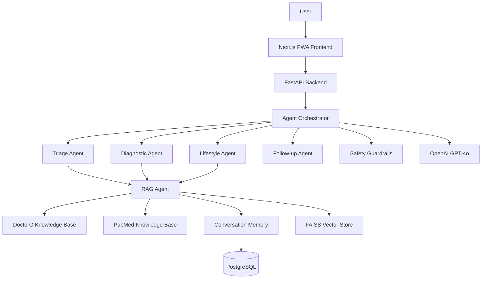

# Medical AI Consultation Platform - Agentic System Revamp

## Architecture Overview



## Phase 1: Cleanup & Archive (Remove Training Code)

### Files to Delete Completely

- Root-level legacy files:
  - `train_doctorg.py` (old TensorFlow training)
  - `main.py` (old Streamlit app)
  - `midway.py` (legacy script)
  - `DoctorG.ipynb` (old notebook)
  - `doctor-training.ipynb` (training notebook)
  - `doctorg_data.csv` (duplicate - keep backend version)
  - `doctorg_processed.csv` (duplicate)
  - `requirements.txt` (root level - use backend/requirements.txt)
  - `start.sh` and `start.bat` (replaced by Docker)
  - `en_core_web_sm/` directory (unused spaCy model)
  - `Info` file

### Training Scripts to Archive

Move to [`backend/scripts_archive/`](backend/scripts_archive/) (not deleted per user request):

- `backend/scripts/train_llm.py`
- `backend/scripts/prepare_training_data.py`
- `backend/scripts/web_agent.py`

### Update Documentation

- Remove training instructions from [`README.md`](README.md)
- Add new agentic system architecture documentation
- Document OpenAI API usage instead of local model training

---

## Phase 2: Backend - Multi-Agent System

### 2.1 Create Agent Framework

**New file structure:**

```
backend/app/agents/
├── __init__.py
├── base.py                    # BaseAgent abstract class
├── orchestrator.py            # Agent coordinator
├── triage_agent.py           # Initial assessment
├── diagnostic_agent.py       # Condition analysis
├── lifestyle_agent.py        # Recommendations
├── followup_agent.py         # Clarifying questions
├── guardrails_agent.py       # Safety checks
└── rag_agent.py              # Knowledge retrieval
```

**Key Components:**

1. **BaseAgent** ([`backend/app/agents/base.py`](backend/app/agents/base.py))

   - Abstract base class with common interface
   - OpenAI API integration
   - Prompt template management
   - Response parsing

2. **AgentOrchestrator** ([`backend/app/agents/orchestrator.py`](backend/app/agents/orchestrator.py))

   - Manages agent chain execution
   - Decides which agents to invoke
   - Aggregates agent outputs
   - Maintains conversation context

3. **TriageAgent** - Assesses urgency and routes consultation
4. **DiagnosticAgent** - Provides differential diagnosis
5. **LifestyleAgent** - Suggests lifestyle modifications
6. **FollowUpAgent** - Generates clarifying questions
7. **GuardrailsAgent** - Flags emergency symptoms, prevents harmful advice
8. **RAGAgent** - Retrieves relevant medical knowledge

### 2.2 RAG System Enhancement

**Extend existing RAG:**

1. **Medical Knowledge Base** ([`backend/app/ml/rag/medical_knowledge.py`](backend/app/ml/rag/medical_knowledge.py))

   - Ingest DoctorG CSV data (symptoms, diseases, descriptions)
   - Create FAISS vector index from medical descriptions
   - Metadata storage: disease code, symptoms, risk factors

2. **PubMed Knowledge Base** ([`backend/app/ml/rag/pubmed_knowledge.py`](backend/app/ml/rag/pubmed_knowledge.py))

   - Index PubMed abstracts from existing web_agent data
   - Store medical literature embeddings
   - Citation-ready retrieval

3. **Enhanced Memory Engine** ([`backend/app/ml/rag/memory_engine.py`](backend/app/ml/rag/memory_engine.py))

   - Current: User conversation history ✅
   - Add: Multi-turn conversation tracking
   - Add: Conversation summarization
   - Add: Context window management

4. **Unified RAG Agent** ([`backend/app/agents/rag_agent.py`](backend/app/agents/rag_agent.py))

   - Query all three knowledge sources
   - Hybrid retrieval (user history + medical KB + literature)
   - Re-ranking based on relevance

### 2.3 OpenAI Integration

**New service:** [`backend/app/services/openai_service.py`](backend/app/services/openai_service.py)

- Replace local LLM inference with OpenAI API
- GPT-4o for medical consultation
- Streaming support for real-time responses
- Token usage tracking
- Error handling and retry logic

**Environment configuration:**

```env
OPENAI_API_KEY=sk-proj-...
OPENAI_MODEL=gpt-4o
OPENAI_MAX_TOKENS=2048
OPENAI_TEMPERATURE=0.7
```

### 2.4 Conversation Memory

**Enhanced conversation tracking:**

1. **Multi-turn sessions** - Track full conversation threads
2. **Context summarization** - Compress long conversations
3. **Symptom tracking** - Accumulate symptoms across turns
4. **Follow-up awareness** - Remember questions asked and answers given

**Database schema update:**

```python
class Conversation(Base):
    id: UUID
    user_id: UUID
    session_id: UUID
    turn_number: int
    role: str  # user / agent / system
    content: str
    agent_type: str  # triage / diagnostic / lifestyle
    metadata: JSON
    created_at: datetime
```

### 2.5 Guardrails System

**Safety checks:**

1. **Emergency detection** - Flag critical symptoms (chest pain, stroke signs)
2. **Disclaimer enforcement** - Always remind users to consult doctors
3. **Medical advice limits** - Prevent prescribing medications
4. **Scope validation** - Reject non-medical queries
5. **Output filtering** - Remove harmful content

**Implementation:** [`backend/app/agents/guardrails_agent.py`](backend/app/agents/guardrails_agent.py)

### 2.6 Refactor Chat API

**Update:** [`backend/app/api/v1/chat.py`](backend/app/api/v1/chat.py)

Replace single LLM call with agent orchestration:

```python
@router.post("/stream")
async def chat_stream(request, current_user, db):
    # Initialize orchestrator
    orchestrator = AgentOrchestrator(
        openai_service=openai_service,
        rag_agent=rag_agent,
        memory_engine=memory_engine
    )
    
    # Run agent chain
    async for chunk in orchestrator.process_stream(
        user_message=request.message,
        symptoms=request.symptoms,
        user_id=current_user.id,
        session_id=request.session_id,
        db=db
    ):
        yield f"data: {chunk.json()}\n\n"
```

### 2.7 Constants & Error Management

**Update:** [`backend/app/core/constants.py`](backend/app/core/constants.py)

Add agent-specific constants:

```python
class AgentTypes:
    TRIAGE = "triage"
    DIAGNOSTIC = "diagnostic"
    LIFESTYLE = "lifestyle"
    FOLLOWUP = "followup"
    GUARDRAILS = "guardrails"
    RAG = "rag"

class GuardrailFlags:
    EMERGENCY = "emergency"
    SEEK_IMMEDIATE_CARE = "seek_immediate_care"
    CONSULT_DOCTOR = "consult_doctor"
    
class OpenAIConfig:
    MODEL = "gpt-4o"
    MAX_TOKENS = 2048
    TEMPERATURE = 0.7
    STREAMING = True
```

**New file:** [`backend/app/core/errors.py`](backend/app/core/errors.py)

- Custom exception classes
- Error codes and messages
- HTTP status code mappings

### 2.8 Remove Legacy LLM Code

**Delete:**

- [`backend/app/ml/llm/inference.py`](backend/app/ml/llm/inference.py) (local model inference)
- [`backend/app/services/subscription.py`](backend/app/services/subscription.py) (session limits for local model)

**Update dependencies:** [`backend/requirements.txt`](backend/requirements.txt)

- Remove: `transformers`, `torch`, `peft`, `bitsandbytes`
- Add: `openai>=1.0.0`
- Keep: `fastapi`, `sqlalchemy`, `sentence-transformers`, `faiss-cpu`

---

## Phase 3: Frontend - PWA Revamp

### 3.1 Progressive Web App Setup

**New files:**

- [`frontend/public/manifest.json`](frontend/public/manifest.json) - PWA manifest
- [`frontend/public/service-worker.js`](frontend/public/service-worker.js) - Offline support
- [`frontend/public/icons/`](frontend/public/icons/) - App icons (72x72 to 512x512)

**Update:** [`frontend/pages/_app.tsx`](frontend/pages/_app.tsx)

- Register service worker
- Add meta tags for PWA
- iOS-specific meta tags

### 3.2 Design System & Branding

**Create:** [`frontend/src/constants/branding.ts`](frontend/src/constants/branding.ts)

```typescript
export const BRANDING = {
  APP_NAME: 'DoctorG',
  TAGLINE: 'AI-Powered Medical Consultation',
  LOGO_PATH: '/logo.svg',
  PRIMARY_COLOR: '#10B981',  // Medical green
  DISCLAIMER: 'This is not a substitute for professional medical advice...'
} as const
```

**Logo design:**

- Create professional medical AI logo
- SVG format for scalability
- Medical cross + AI neural network theme
- Location: [`frontend/public/logo.svg`](frontend/public/logo.svg)

### 3.3 Frontend Constants

**New file:** [`frontend/src/constants/messages.ts`](frontend/src/constants/messages.ts)

```typescript
export const ERROR_MESSAGES = {
  NETWORK_ERROR: 'Connection failed. Please check your internet.',
  SESSION_EXPIRED: 'Your session has expired. Please login again.',
  INVALID_INPUT: 'Please provide valid symptoms.'
} as const

export const SUCCESS_MESSAGES = {
  MESSAGE_SENT: 'Message sent successfully'
} as const
```

**Update:** [`frontend/src/constants/api.ts`](frontend/src/constants/api.ts)

- Add all API endpoint constants
- Environment-based base URL configuration

### 3.4 Enhanced Chat Interface

**Update:** [`frontend/src/components/Chat/ChatInterface.tsx`](frontend/src/components/Chat/ChatInterface.tsx)

New features:

- Multi-turn conversation display
- Agent type indicators (which agent responded)
- Emergency warnings display (from guardrails)
- Follow-up question prompts
- Lifestyle recommendations panel
- "New Consultation" button to start fresh

**Update:** [`frontend/src/components/Chat/MessageList.tsx`](frontend/src/components/Chat/MessageList.tsx)

- Agent-specific message styling
- Citation badges for RAG sources
- Structured response rendering (conditions, tests, recommendations)

### 3.5 State Management Updates

**Update:** [`frontend/src/stores/chatStore.ts`](frontend/src/stores/chatStore.ts)

Enhanced state:

```typescript
interface ChatStore {
  sessionId: string
  messages: Message[]
  currentAgent: AgentType | null
  isStreaming: boolean
  guardrailWarnings: string[]
  suggestedQuestions: string[]
  addMessage: (message: Message) => void
  setCurrentAgent: (agent: AgentType) => void
  resetSession: () => void
}
```

### 3.6 No Comments Policy

**All frontend files:**

- Remove plain comments
- Use only tagged comments: `// @TODO`, `// @INFO`, `// @FIX`, `// @BLAIM`
- Self-documenting code with clear variable names

### 3.7 PWA Features

**Offline capabilities:**

- Cache recent conversations
- Queue messages when offline
- Sync when connection restored

**Install prompt:**

- Custom install button in header
- iOS "Add to Home Screen" instructions
- Android install banner

---

## Phase 4: Data Ingestion & Knowledge Base Setup

### 4.1 DoctorG Dataset Ingestion

**Script:** [`backend/scripts/ingest_doctorg_data.py`](backend/scripts/ingest_doctorg_data.py)

Process:

1. Load [`backend/data/doctorg_data.csv`](backend/data/doctorg_data.csv)
2. Clean and preprocess descriptions
3. Generate embeddings using sentence-transformers
4. Create FAISS index
5. Store metadata in PostgreSQL
6. Save index to [`backend/data/faiss_indices/doctorg.index`](backend/data/faiss_indices/doctorg.index)

**Data structure:**

```
CSV: code, name, symptom, weight, description
↓
Embeddings: description → vector[384]
↓
FAISS: Vector index + metadata
↓
PostgreSQL: code, name, symptoms, weights, description
```

### 4.2 PubMed Data Ingestion

**Script:** [`backend/scripts/ingest_pubmed_data.py`](backend/scripts/ingest_pubmed_data.py)

Source: Augmented data from archived [`web_agent.py`](backend/scripts_archive/web_agent.py)

Process:

1. Load existing PubMed abstracts (if available)
2. Generate embeddings from titles + abstracts
3. Create separate FAISS index
4. Store metadata: title, authors, publication_date, pmid
5. Save to [`backend/data/faiss_indices/pubmed.index`](backend/data/faiss_indices/pubmed.index)

### 4.3 Initialization Service

**New service:** [`backend/app/services/knowledge_base_init.py`](backend/app/services/knowledge_base_init.py)

- Load FAISS indices on startup
- Initialize RAG agents with knowledge bases
- Verify data integrity
- Log initialization status

**Update:** [`backend/app/main.py`](backend/app/main.py)

```python
@app.on_event("startup")
async def startup_event():
    await initialize_knowledge_bases()
    logger.info("Knowledge bases loaded successfully")
```

---

## Phase 5: Configuration & Environment

### 5.1 Environment Variables

**Create:** [`.env.example`](.env.example)

```env
# OpenAI Configuration
OPENAI_API_KEY=sk-proj-your_key_here
OPENAI_MODEL=gpt-4o
OPENAI_MAX_TOKENS=2048

# Database
POSTGRES_HOST=localhost
POSTGRES_PORT=5432
POSTGRES_DB=doctorg
POSTGRES_USER=doctorg
POSTGRES_PASSWORD=your_secure_password

# Redis
REDIS_HOST=localhost
REDIS_PORT=6379

# JWT
JWT_SECRET=your_jwt_secret_min_32_chars
JWT_ALGORITHM=HS256

# Application
ENVIRONMENT=development
DEBUG=false
CORS_ORIGINS=http://localhost:3000

# Optional: PubMed (for future data updates)
PUBMED_EMAIL=your_email@example.com
PUBMED_API_KEY=optional_key
```

### 5.2 Configuration Management

**Update:** [`backend/app/core/config.py`](backend/app/core/config.py)

- Pydantic settings for environment variables
- Validation for required fields
- Development vs production configs

---

## Phase 6: Docker & Deployment

### 6.1 Update Docker Compose

**Update:** [`docker-compose.yml`](docker-compose.yml)

Changes:

- Remove GPU requirements (no local model training)
- Simplified backend container (smaller image)
- Add health checks for all services
- Volume mounts for FAISS indices

### 6.2 Backend Dockerfile

**Update:** [`backend/Dockerfile`](backend/Dockerfile)

- Remove CUDA/PyTorch layers
- Lightweight Python 3.11 image
- Only necessary dependencies
- Multi-stage build for smaller image

### 6.3 Frontend Dockerfile

**Update:** [`frontend/Dockerfile`](frontend/Dockerfile)

- Next.js standalone build
- PWA asset optimization
- Service worker caching

---

## Phase 7: Code Quality & Standards

### 7.1 Standards Compliance

Following [`.cursor/rules/project-standards.mdc`](.cursor/rules/project-standards.mdc):

**Backend:**

- ✅ No hardcoded strings (use `constants.py`)
- ✅ No hardcoded secrets (use `.env`)
- ✅ Factory pattern for services
- ✅ Dependency injection
- ✅ Tagged comments only (`@TODO`, `@INFO`, `@FIX`, `@BLAIM`)
- ✅ SSE streaming endpoints
- ✅ Common files: `constants.py`, `errors.py`

**Frontend:**

- ✅ Zustand for state management
- ✅ Constants in dedicated files
- ✅ EventSource for SSE
- ✅ No plain comments
- ✅ TypeScript strict mode

### 7.2 File Organization

**Common pattern across backend:**

```
feature/
├── __init__.py
├── models.py      # Data models
├── service.py     # Business logic
├── routes.py      # API endpoints
└── constants.py   # Feature-specific constants
```

---

## Phase 8: Testing & Documentation

### 8.1 API Documentation

**Update:** [`README.md`](README.md)

New sections:

- Multi-agent system architecture
- OpenAI API setup
- RAG knowledge base setup
- PWA installation
- Agent flow diagrams

### 8.2 API Endpoints Documentation

Auto-generated via FastAPI:

- `/docs` - Swagger UI
- `/redoc` - ReDoc UI

---

## Expected Outcomes

### Backend Improvements

1. **No training code** - Clean, API-only backend
2. **Multi-agent system** - 6 specialized agents
3. **OpenAI GPT-4o** - State-of-the-art medical reasoning
4. **Enhanced RAG** - 3 knowledge sources (user history, DoctorG data, PubMed)
5. **Conversation memory** - Multi-turn context tracking
6. **Guardrails** - Safety-first medical AI
7. **Code quality** - 100% standards compliant

### Frontend Improvements

1. **PWA** - Installable, offline-capable
2. **Professional branding** - Custom logo and design
3. **Enhanced UX** - Agent indicators, structured responses
4. **Constants management** - All strings centralized
5. **No comments** - Clean, self-documenting code

### User Experience

1. **Intelligent triage** - Urgency assessment
2. **Differential diagnosis** - Multiple possible conditions
3. **Lifestyle recommendations** - Actionable health advice
4. **Follow-up questions** - Clarification until complete picture
5. **Safety guardrails** - Emergency warnings and disclaimers
6. **Evidence-based** - RAG-powered medical knowledge

---

## File Changes Summary

**To Delete:** ~15 files (legacy training code, notebooks, duplicates)

**To Create:** ~30 files

- 7 agent implementations
- 3 RAG knowledge bases
- 2 ingestion scripts
- Frontend constants and PWA files
- Configuration and error handling

**To Modify:** ~20 files

- Chat API refactor
- State management updates
- Constants expansion
- Docker configurations
- Dependencies cleanup

**Total:** ~65 file operations