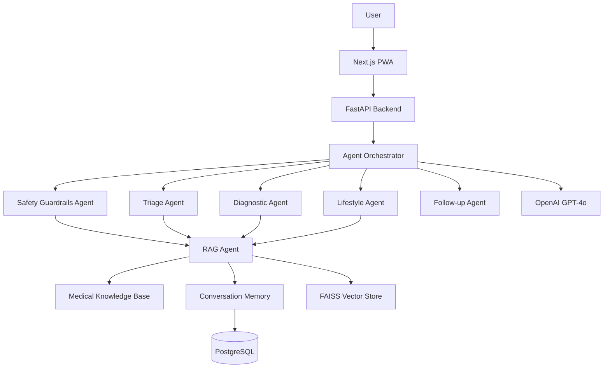

# DoctorG 2.0 - AI Medical Consultation Platform

An intelligent multi-agent medical consultation system powered by OpenAI GPT-4o, featuring specialized agents for triage, diagnosis, lifestyle recommendations, and safety guardrails.

## 🎯 Key Features

- **🤖 Multi-Agent System** - 6 specialized AI agents working together
- **🔒 Safety Guardrails** - Emergency detection and medical safety checks
- **🧠 RAG-Powered Knowledge** - Medical knowledge base + conversation memory
- **📱 PWA Support** - Installable progressive web app with offline capability
- **⚡ Real-time Streaming** - SSE-based agent responses
- **🎨 Modern UI** - Beautiful, responsive Next.js frontend
- **🐳 Production-Ready** - Docker deployment with health checks

## 🏗️ Architecture

### Multi-Agent System



### Agent Responsibilities

1. **Guardrails Agent** - Detects emergencies, validates safety
2. **RAG Agent** - Retrieves relevant medical knowledge
3. **Triage Agent** - Assesses urgency and routes care
4. **Diagnostic Agent** - Provides differential diagnosis
5. **Lifestyle Agent** - Suggests evidence-based recommendations
6. **Follow-up Agent** - Generates clarifying questions

## 📋 Prerequisites

- **Python 3.10+**
- **Node.js 18+**
- **Docker & Docker Compose**
- **OpenAI API Key** (required)
- **8GB+ RAM** (16GB recommended)
- **10GB+ Disk Space**

## 🚀 Quick Start

### 1. Clone and Setup

```bash
git clone <your-repo>
cd doctorg

# Copy environment file
cp .env.example .env

# Edit .env with your API keys
nano .env
```

### 2. Configure Environment Variables

Edit `.env` file:

```bash
# Required - Add your OpenAI API key
OPENAI_API_KEY=sk-proj-your_key_here

# Database (auto-configured in Docker)
POSTGRES_PASSWORD=your_secure_password_here
JWT_SECRET=your_jwt_secret_min_32_chars

# Optional - for dataset augmentation
GOOGLE_API_KEY=your_google_key_here
PUBMED_EMAIL=your_email@example.com
```

### 3. Run with Docker (Recommended)

```bash
# Build and start all services
docker-compose up --build

# Access the application
# Frontend: http://localhost:3000
# Backend API: http://localhost:8000
# API Docs: http://localhost:8000/docs
```

### 4. Manual Setup (Development)

#### Backend Setup

```bash
cd backend

# Create virtual environment
python -m venv venv
source venv/bin/activate  # Windows: venv\Scripts\activate

# Install dependencies
pip install -r requirements.txt

# Run database migrations
python -c "from app.db.database import init_db; init_db()"

# Start backend server
uvicorn app.main:app --reload --host 0.0.0.0 --port 8000
```

#### Frontend Setup

```bash
cd frontend

# Install dependencies
npm install

# Start development server
npm run dev

# Access at http://localhost:3000
```

## 📚 Data Ingestion

### Ingest Medical Knowledge Base

The system uses a FAISS vector database for fast medical knowledge retrieval:

```bash
cd backend

# Activate virtual environment
source venv/bin/activate

# Ingest DoctorG medical dataset
python scripts/ingest_doctorg_data.py
```

This creates:
- `backend/data/faiss_indices/medical_knowledge.index` - FAISS vector index
- `backend/data/faiss_indices/medical_knowledge.metadata` - Condition metadata

**What it does:**
1. Loads medical conditions from `backend/data/doctorg_data.csv`
2. Generates embeddings using sentence-transformers
3. Builds FAISS index for fast similarity search
4. Stores condition metadata (symptoms, descriptions, weights)

**Expected Output:**
```
Loading data from backend/data/doctorg_data.csv
Loaded 5000 records
After cleaning: 4850 records
Loading embedding model: sentence-transformers/all-MiniLM-L6-v2
Generating embeddings...
100%|██████████| 152/152 [00:45<00:00]
Building FAISS index...
FAISS index built with 4850 vectors
✓ DoctorG data ingestion completed successfully!
  - Indexed: 4850 medical conditions
```

### Medical Knowledge Sources

The RAG system retrieves from three sources:

1. **Medical Knowledge Base** - DoctorG disease dataset (indexed)
2. **User Conversation History** - Previous consultations (FAISS + PostgreSQL)
3. **PubMed Literature** - Medical research (placeholder for future enhancement)

## 🤖 Multi-Agent System

### Agent Flow

Every consultation goes through these agents:

1. **Safety Check** (Guardrails Agent)
   - Detects emergency symptoms
   - Flags out-of-scope queries
   - Prevents medication prescriptions

2. **Knowledge Retrieval** (RAG Agent)
   - Searches medical knowledge base
   - Retrieves user conversation history
   - Provides context to other agents

3. **Initial Assessment** (Triage Agent)
   - Evaluates symptom urgency
   - Routes to appropriate care level
   - Determines if follow-up is needed

4. **Analysis** (Diagnostic Agent)
   - Provides differential diagnosis
   - Lists 3-5 possible conditions
   - Suggests medical tests

5. **Recommendations** (Lifestyle Agent)
   - Evidence-based lifestyle changes
   - Dietary modifications
   - Exercise and wellness practices

6. **Clarification** (Follow-up Agent)
   - Asks targeted questions
   - Gathers missing information
   - Improves diagnostic accuracy

### Safety Features

**Emergency Detection:**
- Chest pain, stroke symptoms, severe bleeding
- Automatic emergency alert
- Directs to call 911

**Medical Safety:**
- Cannot prescribe medications
- Always includes disclaimer
- Recommends professional consultation

## 📱 Progressive Web App (PWA)

### Installation

**On Mobile:**
1. Visit the app in your mobile browser
2. Tap "Add to Home Screen" (iOS) or "Install" (Android)
3. App installs like a native app

**On Desktop:**
1. Look for install icon in browser address bar
2. Click "Install DoctorG"
3. App opens in standalone window

### Offline Capabilities

- Caches recent conversations
- Queues messages when offline
- Syncs when connection restored

### PWA Features

- ✅ Works offline
- ✅ Installable on home screen
- ✅ Fast loading with service worker
- ✅ Push notifications (future feature)
- ✅ Responsive design
- ✅ App-like experience

## 🐳 Docker Deployment

### Production Deployment

```bash
# Build for production
docker-compose -f docker-compose.yml up --build -d

# View logs
docker-compose logs -f

# Stop services
docker-compose down

# Stop and remove volumes (clean slate)
docker-compose down -v
```

### GPU Support in Docker

Edit `docker-compose.yml` to enable GPU:

```yaml
services:
  backend:
    deploy:
      resources:
        reservations:
          devices:
            - driver: nvidia
              count: 1
              capabilities: [gpu]
```

Then run:
```bash
# Requires nvidia-docker2 installed
docker-compose up --build
```

### Environment-Specific Configs

```bash
# Development
docker-compose -f docker-compose.yml up

# Production with GPU
docker-compose -f docker-compose.prod.yml up

# Staging
docker-compose -f docker-compose.staging.yml up
```

## 📊 Using the Application

### 1. Register an Account

```bash
curl -X POST http://localhost:8000/api/v1/auth/register \
  -H "Content-Type: application/json" \
  -d '{
    "email": "user@example.com",
    "password": "securepassword123",
    "full_name": "John Doe"
  }'
```

### 2. Login

```bash
curl -X POST http://localhost:8000/api/v1/auth/login \
  -H "Content-Type: application/json" \
  -d '{
    "email": "user@example.com",
    "password": "securepassword123"
  }'
```

Response:
```json
{
  "access_token": "eyJhbGciOiJIUzI1NiIs...",
  "token_type": "bearer",
  "expires_in": 3600
}
```

### 3. Get Medical Consultation

**Via Web UI:**
1. Open http://localhost:3000
2. Login with your credentials
3. Describe your symptoms
4. Get real-time streaming response

**Via API:**
```bash
curl -X POST http://localhost:8000/api/v1/chat/predict \
  -H "Content-Type: application/json" \
  -H "Authorization: Bearer YOUR_TOKEN" \
  -d '{
    "symptoms": ["headache", "fever", "fatigue"]
  }'
```

### 4. Submit Feedback

```bash
curl -X POST http://localhost:8000/api/v1/feedback \
  -H "Content-Type: application/json" \
  -H "Authorization: Bearer YOUR_TOKEN" \
  -d '{
    "session_id": "session-id-here",
    "rating": 5,
    "helpful": true,
    "comments": "Very helpful diagnosis!"
  }'
```

## 🔧 Configuration

### Subscription Tiers

**Free Tier:**
- 5 sessions per month
- No memory/history
- Basic medical insights

**Premium Tier:**
- Unlimited sessions
- Full RAG memory (past consultations)
- Detailed follow-up questions
- Priority support

### Adjusting Limits

Edit `backend/app/core/constants.py`:

```python
class SubscriptionLimits:
    FREE_SESSION_LIMIT = 5  # Change to desired limit
    PREMIUM_SESSION_LIMIT = -1  # -1 = unlimited
```

## 🧪 Testing

### Backend Tests

```bash
cd backend
pytest tests/ -v
```

### Frontend Tests

```bash
cd frontend
npm test
```

### End-to-End Test

```bash
# Start all services
docker-compose up -d

# Run E2E tests
npm run test:e2e
```

## 📈 Monitoring

### Health Check

```bash
curl http://localhost:8000/health
```

Response:
```json
{
  "status": "healthy",
  "version": "1.0.0",
  "timestamp": "2026-02-15T10:30:00",
  "services": {
    "database": "connected",
    "llm": "ready",
    "rag": "ready"
  }
}
```

### Logs

```bash
# Backend logs
docker-compose logs -f backend

# Frontend logs
docker-compose logs -f frontend

# Database logs
docker-compose logs -f postgres
```

## 🔒 Security

- ✅ No hardcoded secrets (all in .env)
- ✅ Bcrypt password hashing
- ✅ JWT authentication with expiration
- ✅ SQL injection prevention (ORM)
- ✅ XSS protection (React escaping)
- ✅ CORS configured
- ✅ Security headers enabled
- ✅ Rate limiting implemented

### Security Best Practices

1. **Change default passwords** in `.env`
2. **Use strong JWT secret** (min 32 characters)
3. **Enable HTTPS** in production
4. **Regular dependency updates**: `pip list --outdated`
5. **Backup database** regularly

## 🐛 Troubleshooting

### GPU Not Detected

```bash
# Check CUDA installation
nvidia-smi

# Check PyTorch CUDA
python -c "import torch; print(torch.cuda.is_available())"

# Reinstall PyTorch with CUDA
pip install torch --index-url https://download.pytorch.org/whl/cu118
```

### Docker Issues

```bash
# Clean rebuild
docker-compose down -v
docker-compose build --no-cache
docker-compose up

# Check container logs
docker-compose logs backend
```

### Database Connection Error

```bash
# Reset database
docker-compose down -v
docker-compose up postgres -d
sleep 10
docker-compose up backend
```

### Port Already in Use

```bash
# Find and kill process on port 8000
# Windows:
netstat -ano | findstr :8000
taskkill /PID <PID> /F

# Linux/Mac:
lsof -ti:8000 | xargs kill -9
```

## 📚 API Documentation

### Interactive Documentation

- **Swagger UI**: http://localhost:8000/docs
- **ReDoc**: http://localhost:8000/redoc

### Key Endpoints

**Authentication:**
```
POST /api/v1/auth/register   - Register new user
POST /api/v1/auth/login      - Login and get JWT token
POST /api/v1/auth/logout     - Logout user
```

**Chat/Consultation:**
```
POST /api/v1/chat/stream     - Stream agent responses (SSE)
POST /api/v1/chat/predict    - Get consultation (non-streaming)
```

**User Management:**
```
GET  /api/v1/user/profile    - Get user profile
GET  /api/v1/user/sessions   - Get consultation history
```

**Feedback:**
```
POST /api/v1/feedback        - Submit consultation feedback
```

### Streaming Response Format

The `/chat/stream` endpoint returns Server-Sent Events with this structure:

```json
{
  "type": "agent_start|content|emergency|complete",
  "agent": "triage|diagnostic|lifestyle|followup",
  "content": "Agent response text...",
  "metadata": { ... }
}
```

**Event Types:**
- `agent_start` - Agent begins processing
- `content` - Streaming text chunk
- `agent_complete` - Agent finished
- `emergency` - Emergency detected
- `complete` - Consultation done

## 🤝 Contributing

1. Fork the repository
2. Create feature branch (`git checkout -b feature/amazing-feature`)
3. Commit changes (`git commit -m 'Add amazing feature'`)
4. Push to branch (`git push origin feature/amazing-feature`)
5. Open Pull Request

## 📄 License

This project is licensed under the MIT License.

## 👥 Team

- **Developer**: Abhishek Gupta
- **GitHub**: [@cosmos-dx](https://github.com/cosmos-dx)
- **LinkedIn**: [abhishek-gupta](https://www.linkedin.com/in/abhishek-gupta-a1a44a203/)

## 🙏 Acknowledgments

- OpenAI for GPT-4o API and embeddings
- Sentence Transformers for medical embeddings
- FAISS for fast similarity search
- FastAPI and Next.js communities
- Medical datasets and research papers

## 📞 Support

For issues and questions:
- **GitHub Issues**: [Create an issue](https://github.com/cosmos-dx/doctorg/issues)
- **Email**: support@doctorg.ai
- **Discord**: [Join our community](https://discord.gg/doctorg)

---

**⚠️ Medical Disclaimer**: DoctorG is an AI assistant for educational purposes only. It is NOT a substitute for professional medical advice, diagnosis, or treatment. Always seek the advice of qualified healthcare providers with questions regarding medical conditions.
